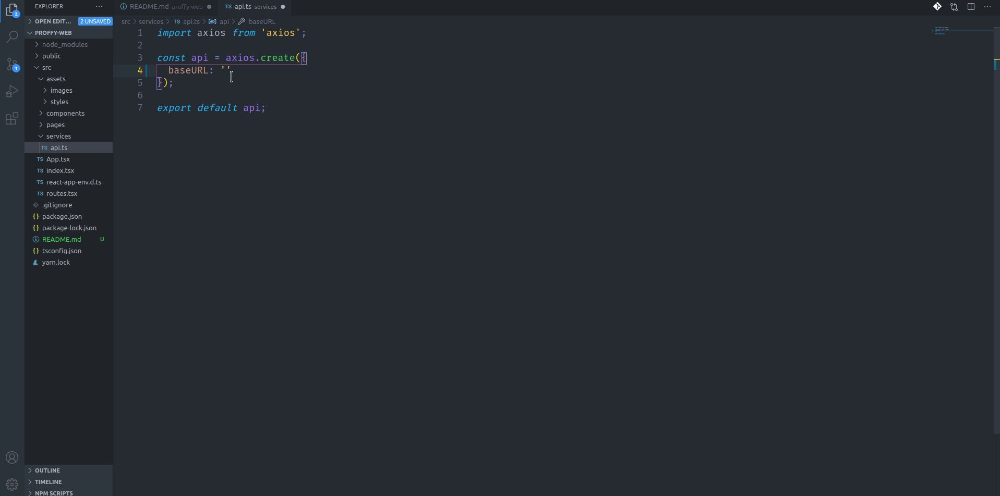
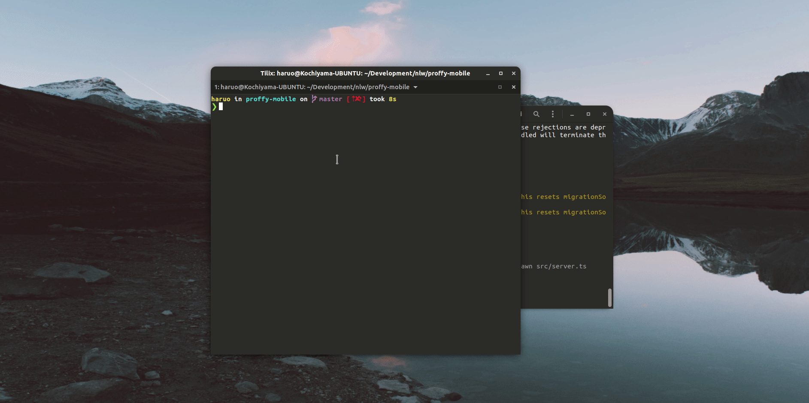

<h1 style="text-align: center; font-size: 50px">
  Proffy Mobile
</h1>

Full stack project with mobile, web and API. A plataform that connects inependent teachers and students.
Project initially developed at **Next Level Week #2** from @Rocketseat.
 
### The complete project is constituted by these three repositories:

- [Web](https://github.com/Kochiyama/proffy-web) 
- [Mobile](https://github.com/Kochiyama/proffy-mobile) 
- [Api](https://github.com/Kochiyama/proffy-api)

### Current Project State: :hammer_and_wrench: Working :hammer_and_wrench: 
---
## Features list (also todo-list)

- [x] Landing Screen
- [x] Show total connections on Landing screen
- [x] Study screen
- [x] Filter teacher classes
- [x] Add teacher classes to favorites
- [x] Remove teacher classes from favorites
- [x] List favorites
- [x] Store favorites on mobile asyncStorage
- [x] Give-classes screen
- [ ] Login
- [ ] Log-out
- [ ] Register
- [ ] Store Favorites on Api
- [ ] Teacher register on mobile
- [ ] Show all classes by page
- [ ] Dinamically filter classes
- [ ] User page
- [ ] Update user data

---
## Preview: Mobile
Little visual bugs caused by screen recorder!


---

## Dependencies (Pre-requisites)

Before try :microscope: proffy-api from your own local network you must have installed the following dependencies:

- [NodeJS](https://nodejs.org/en/download/)
- [yarn](https://classic.yarnpkg.com/en/docs/install/#debian-stable)
- [git](https://git-scm.com/downloads)
- [expo](https://expo.io/tools#cli) - install expo cli, and for testing on your real device, download teh expo client on it.

## Test the dependencies
Into your terminal run:  

### Node

```
node --version
```
Output expected:   
`v12.8.3`

### Yarn

```
yarn --version
```
Output expected:  
`v1.22.4`

### Git

```
git --version
```
Output expected:  
`git version 2.25.1`

The versions can vary, if they vary too much and some bug occur, unninstall the current version and install the exact version of outputs above. 


## Set up the Mobile app

Clone this repository, into your terminal run: 
```
git clone https://github.com/Kochiyama/proffy-mobile
```

Then change the actual directory to the proffy-api folder, run: 
```
cd proffy-mobile
```

Install all the packages automatically, just run: 
```
yarn
```

Set-up API address:

:warning: before proceding you must set up the [Api](https://github.com/Kochiyama/proffy-api)
follow the instructions into the link above

with your 'API address' in hands, open the `api.ts` file on your text editor (my recomendation: vscode). 
It is located at `proffy-web/src/services`  
Then replace the Base_url string to your api address:



And finally: 
```
yarn start
```



---
# Open proffy on your device

open expo client

click in scan Qr code

scan the qr code from metro blundler

done!


---

## :black_nib: Feedback
If you found a bug or error feel free to create a **new issue** on this repository  
Any feeedbacks and opinions are welcome, send me a e-mail:
marcelokochiyamadev@gmail.com